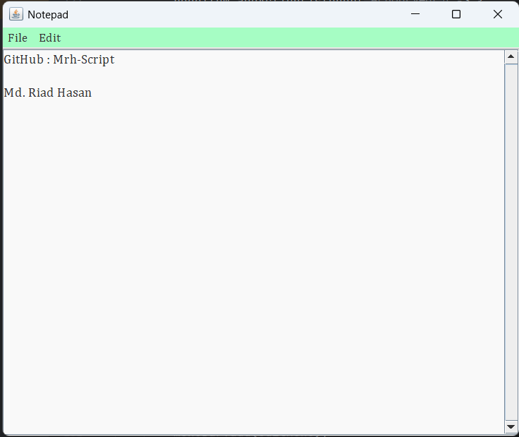
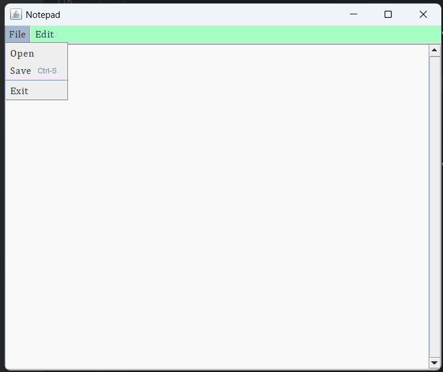
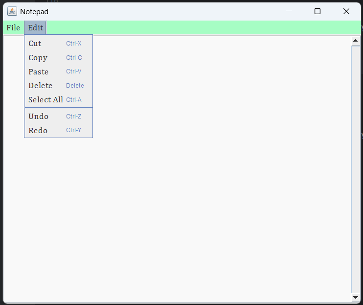

# 📝 NotePad

## 📌 Summary

This is a simple Notepad app made with Java Swing. You can type, edit, open, and save text files. It has a clean look and is easy to use. It also lets you undo and redo your changes.

## ✨ Features

- Open and Save `.txt` files
- Undo and Redo support via `UndoManager`
- Cut, Copy, Paste, Delete, and Select All
- Clean UI with Cambria font and custom color scheme
- Keyboard shortcuts for all essential functions

---

## 📸 Interface

---

## 👤 Author

**Md. Riad Hasan**  
BSCSE  
**Uttara University** 

